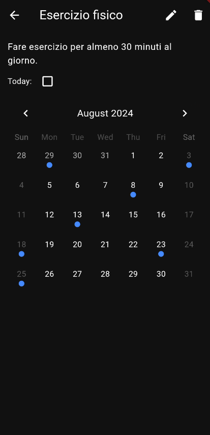

# Habits App
[Alessandro Zacchilli](https://github.com/Zack9961), Matricola: 324606

Habist App è progettata per aiutare gli utenti a tenere traccia delle loro abitudini quotidiane, come bere acqua, fare esercizio fisico e meditare. L'obiettivo principale è fornire uno strumento semplice e intuitivo che aiuti gli utenti a mantenere e gestire le abitudini che vuole perseguire.

## Casi d'uso ed esperienza utente
### Schermata principale e aggiunta di una nuova abitudine

{width="50%"}

{width="50%"}

Un utente che, per esempio, ha difficoltà a mantenere l'abitudine di fare esercizio fisico e di leggere un libro che vuole finire può essere motivato grazie a questa applicazione. All'avvio non dovrà fare altro che cliccare nel pulsante in alto per raggiungere la schermata di creazione di un'abitudine, inserire le informazioni (Nome dell'abitudine e relativa descrizione) e confermare. Una volta inserite le abitudini, verrà ricondotto alla schermata principale, che questa volta sarà popolata dalle abitudini che ha inserito, ora potrà segnare il completamento di ogni abitudine nel riquadro apposito. Il completamento è giornaliero, quindi quando si spunta il riquadro, vuol dire che per quel giorno l'abitudine è stata fatta. 

**Design Responsive**

La schermata principale può cambiare nel caso in cui lo schermo sia orizzontale, aggiungendo una nuova colonna, che indica se l'abitudine è stata completata o meno, nella giornata di ieri.

{width="50%"}

### Schermata di visualizzazione dei dettagli e modifica
 
Dopo vari utilizzi, l'utente può cliccare sull'abitudine che farà aprire una schermata relativa ai dettagli; al suo interno, oltre al nome e alla descrizione, sarà visualizzato un calendario dove saranno segnati i giorni in cui ha completato l'abitudine, aumentando possibilmente la motivazione.

{width="50%"}

Come si può notare dallo screenshot, l'utente può anche selezionare i pulsanti in alto a destra per cancellare o modificare l'abitudine. Se viene premuto il pulsante di modifica, si aprirà una schermata simile a quella per aggiungere un'abitudine ma con la possibilità di cambiare nome e descrizione:

{width="50%"}

Una volta completata la modifa si può premere "SAVE" per confermare.

### Importazione di abitudini

L'utente, premendo il pulsante in alto a destra nella schermata principale, può importare abitudini da un servizio esterno tramite una richiesta HTTP, aggiungendo così nuove abitudini al proprio database locale.

## Tecnologie utilizzate

### Pacchetti aggiuntivi

Per lo sviluppo dell'applicazione sono stati utilizzati diversi pacchetti aggiuntivi, alcuni nello specifico:

- **table_calendar**: Utile per la visualizzazione e la gestione del calendario nella schermata di dettaglio dell'abitudine
- **uuid**: Per la generazione di stringhe univoche utilizzate per gli ID delle abitudini.
- **json_annotation**: Per facilitare la conversione del file json (scaricato tramite http) alla classe dell'oggeto che rappresenta l'abitudine.
- **sqlite3_flutter_libs e drift**: Utilizzati per la gestione del DB SQLite.
- **http**: Utile per gestire l'importazione delle abitudine tramite API.
- **build_runner**: Pacchetto grazie al quale si creano i file utili per la gestione del db e della conversione dei file json.
- **flutter_riverpod** per l'utilizzo dei provider anche avanzati come lo StateNotifierProvider (utilizzato per la gestione della lista di abitudini).

### Struttura e persistenza dei dati

I dati delle abitudini sono gestiti da una lista di oggetti di tipo "Habit", l'oggetto è composto da 3 campi di tipo String che rappresentano l'id, il nome e la descrizione e da un campo formato da una lista di DateTime. La lista di DateTime è relativa alle date in cui l'utente ha completato l'abitudine. 

La lista è gestita da uno StateNotifierProvider grazie al quale è possibile esporre la lista di abitudini ad altri widget che verranno notificati in caso di modifica dello stato dello StateNotifierProvider

Per la persistenza dei dati è stato utilizzato SQLite, che verrà interrogato all'avvio per visualizzare le varie abitudini salvate. Ad ogni cambiamento della lista segue un aggiornamento al DB, in modo da avere un allineamento con la lista interna. Il DB è composto da due tabelle, una contenente la lista delle abitudini e un'altra contenente le date di ogni abitudine.

**Importazione delle abitudini trimite http**

Per l'importazione è stata implementata la richiesta ad un indirizzo che espone il file json contenente la lista di abitudini. Quando l'utente conferma l'importazione, il file viene scaricato tramite http, viene convertito da json alla lista di oggetti di tipo Habit, poi vengono aggiunti alla lista interna e quindi anche nel DB. In caso di conflitto, cioé se le abitudini importate hanno lo stesso ID di abitudini già presenti, queste ultime vengono sovrascritte.
